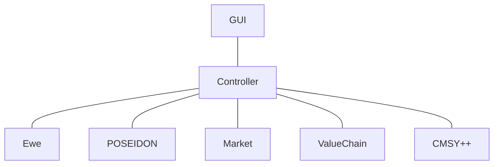

# SURIMI Context Diagram

```mermaid


flowchart TD
    GUI1["GUI"] --- Controller1["Controller"]
    Controller1["Controller"] --- Task1["Ewe"]
    Controller1["Controller"] --- Task2["POSEIDON"]
    Controller1["Controller"] --- Task3["Market"]
    Controller1["Controller"] --- Task4["ValueChain"]
    Controller1["Controller"] --- Task5["CMSY++"]


```

# Legende
