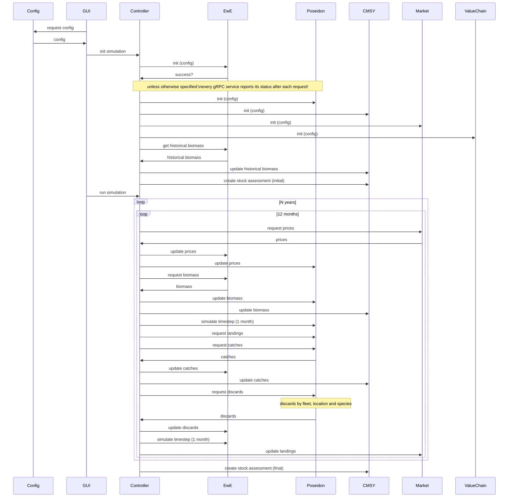

# SURIMI Sequence Diagram

```mermaid

 sequenceDiagram

    participant Config
    participant GUI
    participant Controller
    participant EwE
    participant Poseidon
    participant CMSY
    participant Market
    participant ValueChain

    %% Initialization %%
    %% this is the init %%
    GUI ->> Config: request config
    Config ->> GUI: config
    GUI ->> Controller: init simulation

    Controller ->> EwE: init (config)
    EwE ->> Controller: success?
    Note over Controller, Poseidon: unless otherwise specified:\nevery gRPC service reports its status after each request!
    Controller ->> Poseidon: init (config)
    Controller ->> CMSY: init (config)
    Controller ->> Market: init (config)
    Controller ->> ValueChain: init (config)

    Controller ->> EwE: get historical biomass
    EwE ->> Controller: historical biomass
    Controller ->> CMSY: update historical biomass
    Controller ->> CMSY: create stock assessment (initial)

    %% Simulation %%
    %% starting the simulation %%
    GUI ->> Controller: run simulation

    loop N years
        loop 12 months
            Controller ->> Market: request prices
            Market ->> Controller: prices
            Controller ->> EwE: update prices
            Controller ->> Poseidon: update prices
            Controller ->> EwE: request biomass
            EwE ->> Controller: biomass
            Controller ->> Poseidon: update biomass
            Controller ->> CMSY: update biomass
            Controller ->> Poseidon: simulate timestep (1 month)
            Controller ->> Poseidon: request landings
            Controller ->> Poseidon: request catches
            Poseidon ->> Controller: catches
            Controller ->> EwE: update catches
            Controller ->> CMSY: update catches
            Controller ->> Poseidon: request discards
            Note over Poseidon: discards by fleet, location and species
            Poseidon ->> Controller: discards
            Controller ->> EwE: update discards
            Controller ->> EwE: simulate timestep (1 month)
            Controller ->> Market: update landings
        end
    end
    Controller ->> CMSY: create stock assessment (final) 
```
