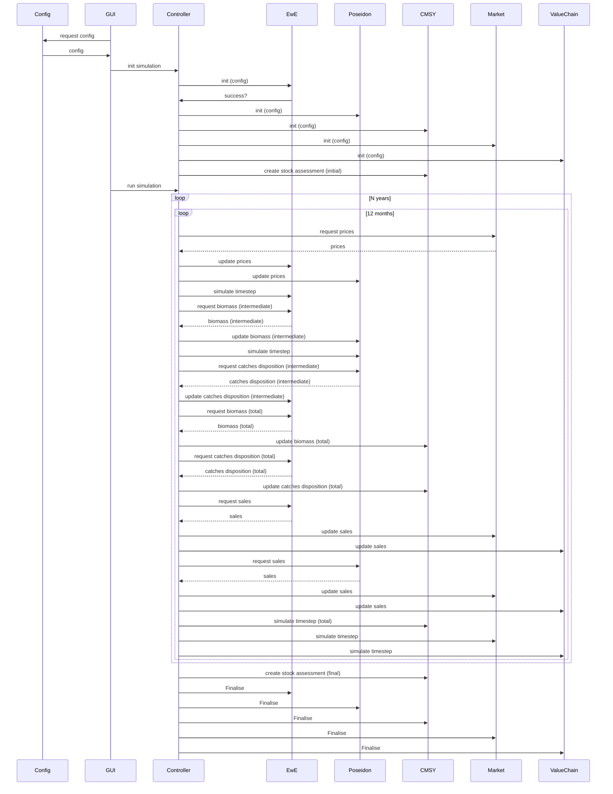

# SURIMI Sequence Diagram

```mermaid

 sequenceDiagram

    participant Config
    participant GUI
    participant Controller
    participant EwE
    participant Poseidon
    participant CMSY
    participant Market
    participant ValueChain

    %% Initialization %%
    %% this is the init %%
    GUI ->> Config: request config
    Config ->> GUI: config
    GUI ->> Controller: init simulation

    Controller ->> EwE: init (config)
    EwE ->> Controller: success?
    Controller ->> Poseidon: init (config)
    Controller ->> CMSY: init (config)
    Controller ->> Market: init (config)
    Controller ->> ValueChain: init (config)

    Controller ->> CMSY: create stock assessment (initial)

    %% Simulation %%
    %% starting the simulation %%
    GUI ->> Controller: run simulation

    loop N years
        loop 12 months
            Controller ->> Market: request prices
            Market -->> Controller: prices
            Controller ->> EwE: update prices
            Controller ->> Poseidon: update prices
            Controller ->> EwE: simulate timestep
            Controller ->> EwE: request biomass (intermediate)
            EwE -->> Controller: biomass (intermediate)
            Controller ->> Poseidon: update biomass (intermediate)
            Controller ->> Poseidon: simulate timestep
            Controller ->> Poseidon: request catches disposition (intermediate) 
            Poseidon -->> Controller: catches disposition (intermediate)
            Controller ->> EwE: update catches disposition (intermediate)

            Controller ->> EwE: request biomass (total)
            EwE -->> Controller: biomass (total)
            Controller ->> CMSY: update biomass (total)
            Controller ->> EwE: request catches disposition (total) 
            EwE -->> Controller: catches disposition (total)
            Controller ->> CMSY: update catches disposition (total)

            Controller ->> EwE: request sales
            EwE -->> Controller: sales
            Controller ->> Market: update sales
            Controller ->> ValueChain: update sales

            Controller ->> Poseidon: request sales
            Poseidon -->> Controller: sales
            Controller ->> Market: update sales
            Controller ->> ValueChain: update sales

            Controller ->> CMSY: simulate timestep (total)
            Controller ->> Market: simulate timestep
            Controller ->> ValueChain: simulate timestep
        end
    end
    Controller ->> CMSY: create stock assessment (final)
    Controller ->> EwE: Finalise
    Controller ->> Poseidon: Finalise
    Controller ->> CMSY: Finalise
    Controller ->> Market: Finalise
    Controller ->> ValueChain: Finalise
```
