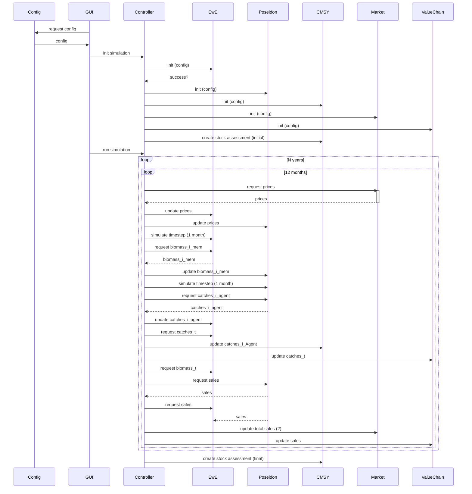

# SURIMI Sequence Diagram

```mermaid

 sequenceDiagram

    participant Config
    participant GUI
    participant Controller
    participant EwE
    participant Poseidon
    participant CMSY
    participant Market
    participant ValueChain

    %% Initialization %%
    %% this is the init %%
    GUI ->> Config: request config
    Config ->> GUI: config
    GUI ->> Controller: init simulation

    Controller ->> EwE: init (config)
    EwE ->> Controller: success?
    Controller ->> Poseidon: init (config)
    Controller ->> CMSY: init (config)
    Controller ->> Market: init (config)
    Controller ->> ValueChain: init (config)

    Controller ->> CMSY: create stock assessment (initial)

    %% Simulation %%
    %% starting the simulation %%
    GUI ->> Controller: run simulation

    loop N years
        loop 12 months
            Controller ->> Market: request prices
            activate Market
            Market -->> Controller: prices
            deactivate Market
            Controller ->> EwE: update prices
            Controller ->> Poseidon: update prices
            Controller ->> EwE: simulate timestep (1 month)
            Controller ->> EwE: request biomass_i_mem
            EwE -->> Controller: biomass_i_mem
            Controller ->> Poseidon: update biomass_i_mem
            Controller ->> Poseidon: simulate timestep (1 month)
            Controller ->> Poseidon: request catches_i_agent
            Poseidon -->> Controller: catches_i_agent
            Controller ->> EwE: update catches_i_agent
            Controller ->> EwE: request catches_t
            Controller ->> CMSY: update catches_i_Agent
            Controller ->> ValueChain: update catches_t
            Controller ->> EwE: request biomass_t
            Controller ->> Poseidon: request sales
            Poseidon -->> Controller: sales
            Controller ->> EwE: request sales
            Poseidon -->> EwE: sales
            Controller ->> Market: update total sales (?)
            Controller ->> ValueChain: update sales
        end
    end
    Controller ->> CMSY: create stock assessment (final) 
```
